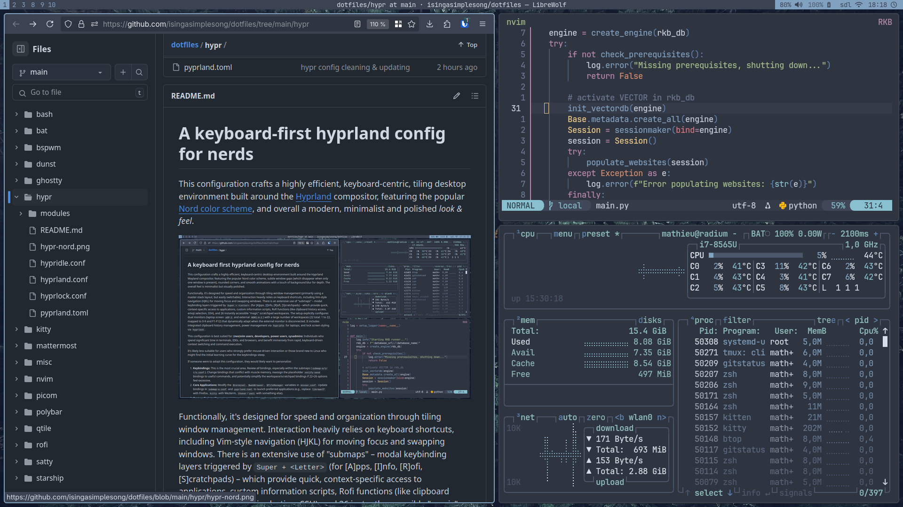

# A keyboard-first hyprland config for nerds

This configuration crafts a highly efficient, keyboard-centric, tiling desktop
environment built around the [Hyprland](https://hyprland.org/) compositor,
featuring the popular [Nord color scheme](https://www.nordtheme.com/), and
overall a modern, minimalist and polished _look & feel_.

Functionally, it's designed for speed and organization through tiling window
management. Interaction heavily relies on keyboard shortcuts, including
Vim-style navigation (HJKL) for moving focus and swapping windows.

- There is an extensive use of "submaps" – modal keybinding layers triggered by
`Super + <Letter>` (A/I/R/S) – which provide quick, context-specific access to
\[A\]pplications, custom \[I\]nformation scripts, \[R\]ofi functions, and 26
instantly accessible "magic" \[S\]cratchpads.

- The setup explicitly configures dynamic dual monitors (a laptop screen `eDP-1`
and an external `HDMI-A-1`) with a large number of workspaces (22 total: 1 to
22, mapped to 0-9 and F1-F12) that adapt their placement when the external
monitor is (dis)connected.

- It includes clipboard history management _via_
[cliphist](https://github.com/sentriz/cliphist), power management & auto lock
_via_ `hypridle` and  `hyprlock`.

- It also use [pyperland](https://github.com/hyprland-community/pyprland) for preset
scratchpads.

This configuration is best suited for **(neo)vim users, developers, power
users, sysadmins and other CLI absolutists:** Individuals who spend significant
time in terminals, text editors, and browsers, and benefit immensely from rapid,
keyboard-driven context switching and command execution.

It's likely less suitable for users who strongly prefer mouse-driven
interaction or those brand new to Linux who might find the initial learning
curve for the keybindings steep.

**If someone were to adopt this configuration, they would likely want to personalize:**

1. **Keybindings:** Review _all_ bindings, especially within the submaps
   (`submap-a/i/r/s.conf`). Change bindings that conflict with muscle memory,
reassign the placeholder `notify-send` bindings to useful commands. The default
placeholder notification is there to make available keys easy to discover.
2. **Core Applications:** Adapt the `$terminal`, `$webBrowser`, `$fileManager`
   variables in `envvar.conf` to your own preferences. Update bindings in
`submap-a.conf` and `pyprland.toml` to launch your preferred applications.
3. **Custom Scripts:** The various scripts called within submaps
   (`notes-dmenu.sh`, `weather.sh`, etc.) are specific. Most of them [are
available here](https://github.com/isingasimplesong/duct-tape/). These need to
be reviewed, potentially rewritten to adjust for your environment, replaced
with different tools, or removed entirely.
4. **Appearance:** Change the color scheme in `colors.conf`, adjust fonts,
   gaps, borders, rounding in `look.conf` and `envvar.conf`. Customize the
associated Rofi theme(s) and Waybar configuration ([available
here](https://github.com/isingasimplesong/dotfiles/tree/main/waybar) and
[here](https://github.com/isingasimplesong/dotfiles/tree/main/rofi)). Modify
the `hyprlock.conf` background and styling.
6. **Input Settings:** Modify keyboard layout, variant, or options (like
   `caps:swapescape`) in `inputs.conf` to match personal hardware and
preferences. Adjust touchpad settings like `natural_scroll`.

## Dependencies

This environment relies on the following components to function properly. They
must be installed and available in your `$PATH`.

### Hyprland ecosystem & system utilities

- [`hyprland`](https://hyprland.org/)
- `hyprctl`
- `hyprlock`
- `hypridle`
- `hyprpicker`
- [`pyprland`](https://github.com/hyprland-community/pyprland) – for scratchpads
- `waybar` – status bar
- `waypaper` – wallpaper setter
- `rofi` – application launcher (used with modules like `emoji`,
- `clipboard-wl` – Wayland clipboard interaction
- `cliphist` – Wayland clipboard history manager
- `nm-applet` – network manager tray icon
- `udiskie` – auto-mounting of removable drives
- `notify-send` – desktop notifications via `libnotify`
`file-browser`, `ssh`, etc.). The main rofi implementation is `X11`-only, so i
use [that wayland compatible fork](https://github.com/in0ni/rofi-wayland)
- `brightnessctl` – screen brightness control
- `pamixer` – volume and mic control
- `playerctl` – multimedia control
- `grim` – Wayland screenshot utility
- `satty` – screenshot annotator/editor (used in `$screenshotModify`, configured [like this](../satty/))
- `xrdb` – loads `.Xresources` (for legacy compatibility)
- `dbus-update-activation-environment` – ensures correct Wayland environment for GUI apps

### Custom scripts

These scripts are used for core desktop functionnalities. Other scripts are
also used throughout submaps or utility bindings, but not required, therefore
not mentionned here. You can replace them with your own, or refer to [this
repository](https://github.com/isingasimplesong/duct-tape) for ready-made
versions.

- `~/.local/bin/waybar-toggle-tray.sh` toggle icons-tray visibility in waybar
- `~/.local/bin/hypr-toggle-layouts.sh` toggle between available layouts (Masterstack/Dwindle)

## Keybinding Cheatsheet

**Modifier Key:**

- `$mainMod`: SUPER (Windows/Command key)

### Application Launchers & Basic Actions

- `$mainMod + return`: Terminal (`$terminal`)
- `$mainMod + space`: Application menu (`~/.config/rofi/launchers/type-2/launcher.sh`)
- `$mainMod + N`: Notes (`~/.local/bin/notes-dmenu.sh`)

### System & Session Control

- `$mainMod + M` : Toogle hypridle (`~/.local/bin/keepawake.sh -t`)
- `$mainMod + SHIFT + M`: Power menu (`~/.config/rofi/powermenu/type-3/powermenu.sh`)
- `Lid Switch Close`: Lock screen and suspend (`hyprlock --immediate-render & systemctl suspend`)

### Waybar Control

- `$mainMod + B`: Toggle waybar visibility
- `$mainMod + SHIFT + B`: Reload waybar config
- `$mainMod + T`: Toggle tray visibility (`~/.local/bin/waybar-toggle-tray.sh`)

### Scratchpads (Pyprland)

- `$mainMod + W`: Toggle Terminal
- `$mainMod + E`: Toggle File Manager
- `$mainMod + O`: Toggle Bitwarden

### Screenshots & Utilities

- `$mainMod + P`: Screenshot active monitor & edit (`grim -o "$active_monitor" - | satty -f -`)
- `$mainMod + SHIFT + P`: Screenshot full desktop & Save (`grim $HOME/Images/Screenshots/screenshot-...png`)
- `$mainMod + ALT + P`: Launch color picker (`hyprpicker -aln`)

### Hardware Keys (Volume / Media / Brightness)

Should work as expected with `pamixer`, `playerctl` & `brightnessctl`

### Window management

#### Closing windows

- `$mainMod + Q`: Close Active Window (graceful) (`killactive`)

#### Window state & position

- `$mainMod + F`: Toggle Floating State
- `$mainMod + ALT + F11`: Toggle fullscreen (monocle layout)
- `$mainMod + C`: Center active floating window
- `$mainMod + ALT + p`: Pin active floating window (toggle)

#### Focus control

- `$mainMod + H`: Focus left
- `$mainMod + L`: Focus right
- `$mainMod + K`: Focus up
- `$mainMod + J`: Focus down

#### Window swapping

- `$mainMod + SHIFT + H`: Swap active window left
- `$mainMod + SHIFT + L`: Swap active window right
- `$mainMod + SHIFT + K`: Swap active window up
- `$mainMod + SHIFT + J`: Swap active window down

#### Resizing windows

- `$mainMod + Left Arrow`: Decrease width
- `$mainMod + Right Arrow`: Increase width
- `$mainMod + Up Arrow`: Decrease height
- `$mainMod + Down Arrow`: Increase height

#### Moving floating windows

- `$mainMod + ALT + Left Arrow`: Move left
- `$mainMod + ALT + Right Arrow`: Move right
- `$mainMod + ALT + Up Arrow`: Move up
- `$mainMod + ALT + Down Arrow`: Move down

#### Mouse actions

- `$mainMod + Mouse Button 1 Drag`: Move window
- `$mainMod + Mouse Button 3 Drag`: Resize window

### Layout management

- `$mainMod + G`: Toggle layouts (`~/.local/bin/hypr-toggle-layouts.sh`)
- `$mainMod + SHIFT + G`: Cycle master orientation
- `$mainMod + TAB`: Roll next window into master position
- `$mainMod + BACKSPACE`: Roll previous window into master position
- `$mainMod + SHIFT + D`: Toggle pseudo tiling (dwindle layout)

### Workspace management

#### Switching workspaces

- `$mainMod + [0-9] | [F1-F12]`: Switch to workspace 1-22

#### Moving windows to workspaces and follow focus

- `$mainMod + SHIFT + [0-9] | [F1-F12]`: Move active window to workspace 1-22

#### Moving windows to workspaces (silently - no focus change)

- `$mainMod + SHIFT + CTRL + [0-9] | [F1-F12]`: Move active window silently to workspace 1-22

### Submaps

#### Submap: [A]pplications (`$mainMod + A` to enter)

- `2`: Launch `enteauth`
- `A`: Launch `alacritty`
- `B`: Launch `brave`
- `C`: Launch `galculator`
- `D`: Launch `transmission-remote-gtk`
- `E`: Launch File Manager (`thunar`)
- `F`: Launch `$webBrowser` (facebook)
- `G`: Launch `ghostty`
- `I`: Launch `$webBrowser` (claude, ai.2027a.net, chatGPT URLs)
- `M`: Launch `$webBrowser` (mm.2027a.net URL)
- `N`: Launch Notes Script (`notes-dmenu.sh`)
- `T`: Launch `brave --tor`
- `U`: Unmount all removable disk
- `V`: Launch `$terminal -e vim`
- `W`: Launch `$webBrowser`
- `Y`: Launch `$terminal -e yazi`
- `Z`: Launch tor browser (`torBrowser-launcher %u`)
- `escape`: Exit submap

#### Submap: [I]nfo (`$mainMod + I` to enter)

- `A`: Show air quality (`~/.local/bin/iq-air.sh`)
- `B`: Show pfview (`~/.local/bin/pfview.sh`)
- `C`: Copy from clipboard history
- `D`: Delete from clipboard history
- `E`: Show CAD exchange rate (`~/.local/bin/cad.sh`)
- `M`: Show weather (`~/.local/bin/weather.sh`)
- `O`: Launch `$webBrowser` (ChatGPT URL)
- `P`: Launch `$webBrowser` (Claude.ai URL)
- `Q`: Launch `$webBrowser` (ai.2027a.net URL)
- `R`: Launch `$webBrowser` (Deepseek Chat URL)
- `S`: Web search via rofi (`~/.local/bin/web-search.sh`)
- `T`: Show date (`~/.local/bin/today.sh`)
- `Z`: Show selected time zones (`~/.local/bin/zones-time.sh`)
- `escape`: Exit submap

#### Submap: [R]ofi (`$mainMod + R` to enter)

- `C`: Copy from clipboard history
- `D`: Delete from clipboard history
- `E`: Show rofi emoji selector
- `F`: Show rofi file browser
- `R`: Launch radio script (`~/.local/bin/radios.sh`)
- `S`: Show rofi SSH launcher
- `W`: Show rofi window switcher
- `escape`: Exit submap

#### Submap: [S]cratchpads (`$mainMod + S` to enter)

_(These use Hyprland's "special" named workspaces for quick scratchpads)_

- `[A-Z]`: Toggle special workspace `[A-Z]`
- `SHIFT + [A-Z]`: Move active window to special workspace `[A-Z]`
- `escape`: Exit submap
