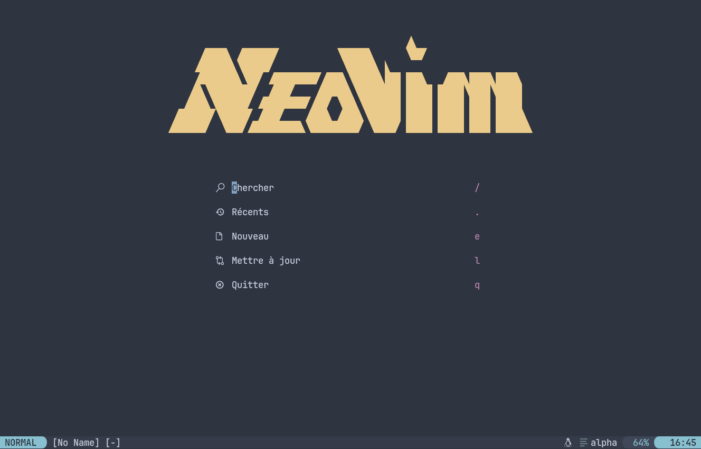
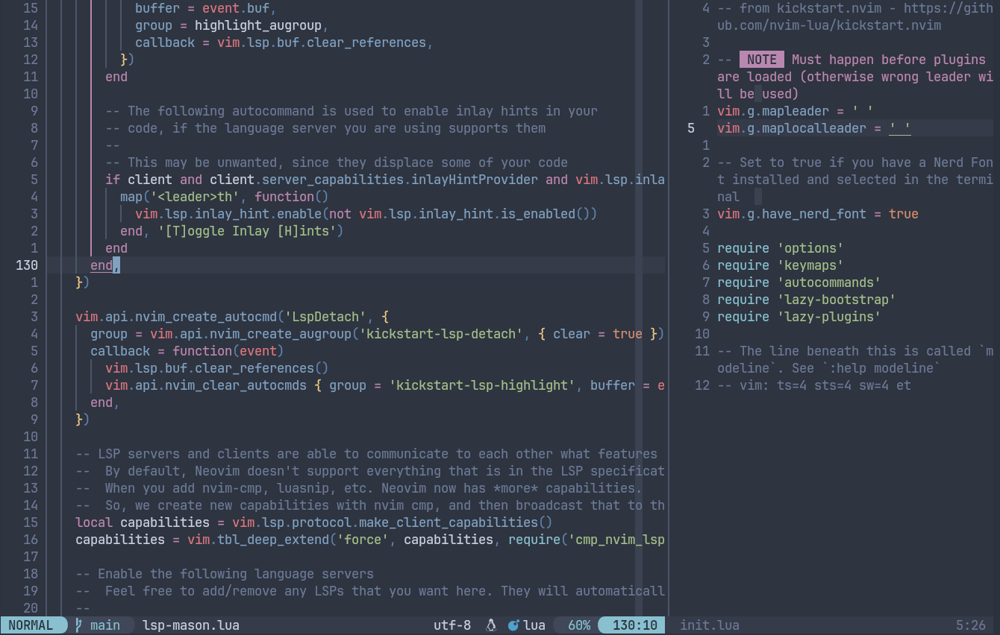
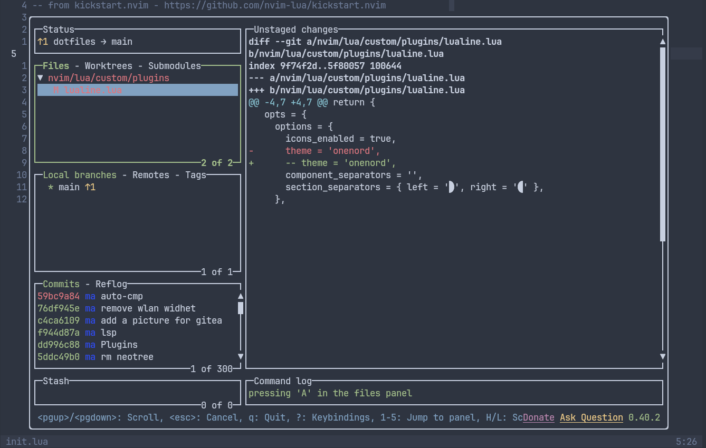
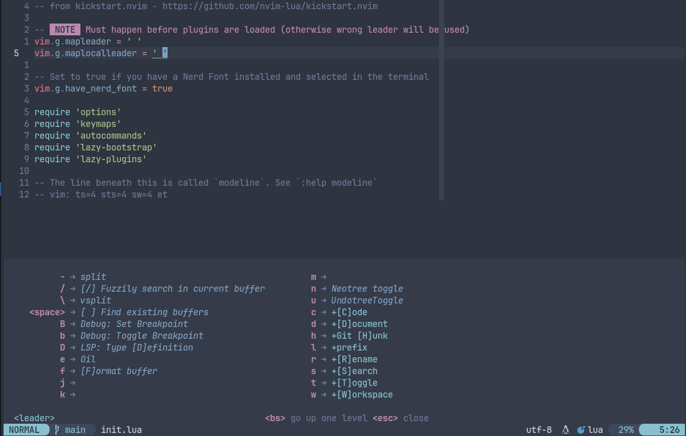
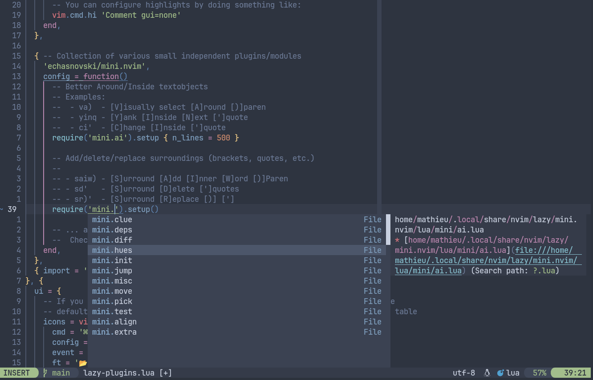
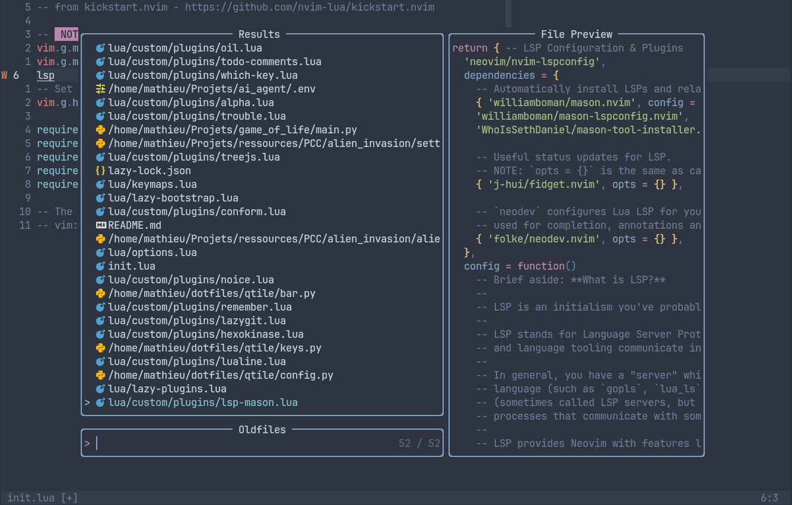

# Neovim FTW

My neovim configuration:

- Based on [Kickstart](https://github.com/nvim-lua/kickstart.nvim)
- Lazy for plugins management
- LSP, code completion, linting, DAP...
- A better [nord](https://www.nordtheme.com/) theme, with [onenord](https://github.com/rmehri01/onenord.nvim)
- Keymap discoverability with [Wich-key](https://github.com/folke/which-key.nvim)
- File management with [Oil.nvim](https://github.com/stevearc/oil.nvim)
- Version management with [LazyGit](https://github.com/kdheepak/lazygit.nvim)
- Powerfull [undotree](https://github.com/mbbill/undotree)
- Search everything with [Telescope](https://github.com/nvim-telescope/telescope.nvim) and [fz](https://github.com/junegunn/fzf)

I basically splitted [Kickstart](https://github.com/nvim-lua/kickstart.nvim)
into pieces, added my favorites plugins, a Nord theme, and a pretty dashboard

